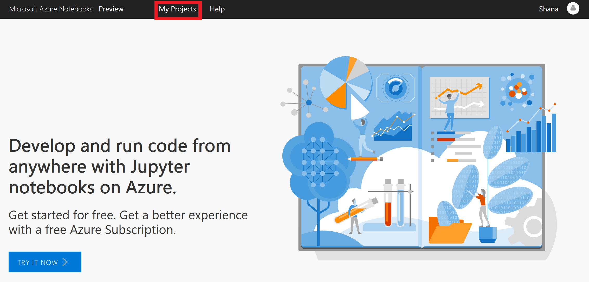
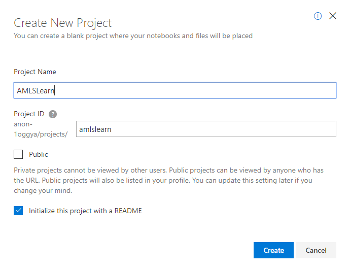
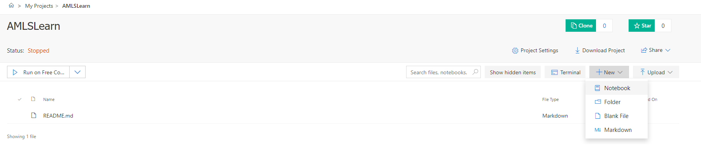
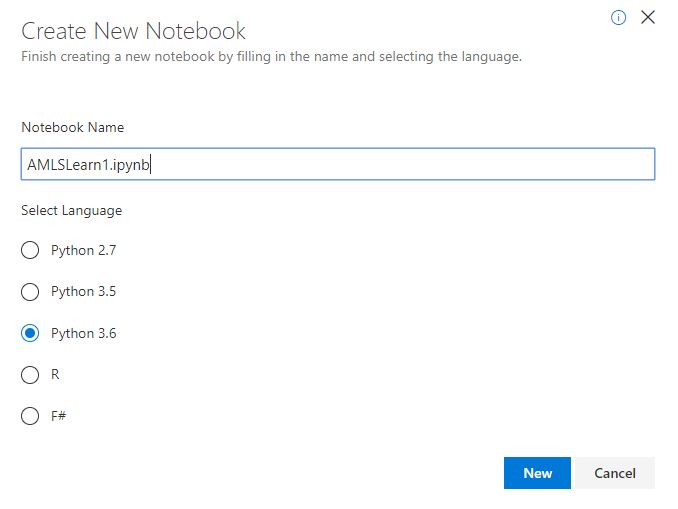
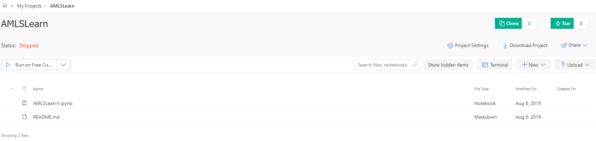
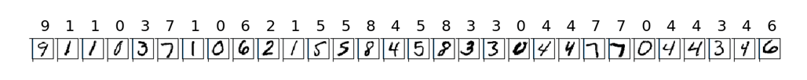

# Azure Machine Learning Handson2019

## はじめに
データ サイエンティストが行う主なタスクの 1 つは、データセットから予測モデルを構築することです。 このようなモデルをワークストリームに組み込むと、コスト予測、変更予測、またはイベント パターンの分析を行って不整合を見つけることができます。 Azure Machine Learning service には、データを準備し、モデルを構築するさまざまな手順を支援するための一連の SDK とクラウド サービスが用意されています。

Azure Machine Learning service を使用すると、データ ラングリング、モデルのトレーニング、モデルの評価、デプロイ、モデルの管理をスケーリングする主要なサービスを実装できます。その結果、ソリューションを提供する能力が大幅に向上します。

### 学習の目的
このモジュールでは、次のことを行います。

Azure Machine Learning Studio と Azure Machine Learning service の違いについて学習する
Azure Machine Learning service がデータ サイエンス プロセスにどのように適合するかを確認する
Azure Machine Learning service の実験に関連する概念について学習する
Azure Machine Learning service のパイプラインを調べる
Azure Machine Learning service を使用してモデルをトレーニングする

## Azure Machine Learning service と Azure Machine Learning Studio
名前が似ているので、Microsoft Azure Machine Learning Studio と Azure Machine Learning service を区別することが重要です。 これらの製品はどちらも機械学習モデルの開発とデプロイに使用できますが、サポートするニーズは異なります。
### Azure Machine Learning Studio 
ユーザー フレンドリでプログラミングの必要がないドラッグ アンド ドロップ方式のビジュアル ワークスペースです。 データ サイエンスの学習と小規模な機械学習プロジェクトに最適です。
### Azure Machine Learning service
機械学習モデルをスケーリング、監視、デプロイするための呼び出し可能なサービスが提供されます。 それは、統合された Azure サービスでデータ サイエンス パイプラインを強化および拡張するためのものです。 Azure Machine Learning service SDK を使用すると、このような事前構築済みサービスを使用するコードを記述し、それをデータ サイエンス ワークフローに統合することができます。

好みの Python ツールとオープン ソース フレームワークを使用して、ローカル コンピューターでモデルの開発を始めます。 次に、Python モジュールを通して Azure Machine Learning service を使用し、モデルのトレーニングと評価、ハイパーパラメーターの調整、および呼び出し可能な REST API を使用した完全なデプロイを短時間で行います。

## データ サイエンス プロセス内の Azure Machine Learning service
Azure Machine Learning service を理解するために、次に示されている機械学習の開発プロセスにそれがどのように適合するかを考えてみましょう。


### 環境のセットアップ
まずワークスペースを作成します。これは Azure で機械学習の作業を保存するための場所です。 ワークスペースは、Azure portal または Python コード内から作成できます。 トレーニングしてテストするモデルの実行に関する情報を格納するため、ワークスペース内に実験オブジェクトを作成します。 1 つのワークスペースに複数の実験オブジェクトを作成できます。

Azure Machine Learning service を使用すると、ローカルの Jupyter ノートブック、PyCharm、または Azure Notebooks (Jupyter Notebook のクラウド版) のノートブックなど、好みの統合開発環境 (IDE) を使用してワークスペースとやり取りできます。 このモジュールで後ほど説明しますが、環境を構成するのは簡単です。

## データの準備

モデルをトレーニングするには、その前に、ソース データを調べて分析し、その品質を判断して、モデルの特徴にあったデータを選択する必要があります。 通常、これには統計分析と視覚化の使用が含まれます。 その後、データ ラングリングのステップでは、データをクリーンアップして変換を適用し、モデルのトレーニングで使用できるように準備します。

Pandas や、Azureml.dataprep と呼ばれる Azure Machine Learning Data Preparation SDK など、任意の Python モジュールをデータの準備に使用できます。　 

## 実験
実験は、モデルのトレーニングとテストの反復的なプロセスです。 Scikit-learn、TensorFlow、その他のオープン ソース パッケージがサポートされています。

モデルを構築した後は、ローカル環境またはリモート コンピューター上でモデルをトレーニングできます。

Azure Machine Learning service の重要な機能は、Azure コンテナー内でモデルのトレーニングと評価を実行する機能です。 Azureml パッケージを使用すると、簡単にリモート モデルの実行を監視し、出力を取得することができます。 また、コンピューティング リソースのプロビジョニングに使用されるコンピューティング先オブジェクトを作成して構成する必要があります。

運用環境で使用するモデルを作成したら、ワークスペースにモデルを登録します。

## デプロイ
モデルが正常に、必要な正確さのレベルで実行することを、ローカル環境で確認した後、モデルをデプロイすることができます。

Docker イメージを作成し、Azure Container Instances にデプロイします。 注:他に使用できるターゲット環境には、Azure Kubernetes Service (AKS)、Azure IoT Edge、フィールド プログラマブル ゲート アレイ (FPGA) などがあります。 デプロイには、次のファイルが必要です。

スコア スクリプト ファイルは、モデルの実行方法を決定するために必要です。
環境ファイルは、オープン ソース パッケージを使用する場合に重要なパッケージの依存関係を指定するために必要です。
構成ファイルは、適切な量のリソースをコンテナーに要求するために必要です。

## 械学習の実験を作成する
Azure Machine Learning service の主要なコンポーネントについて考えてみましょう。 次の図は、Azure Machine Learning service 内のデータ サイエンス プロセスを示しています。


通常、プロセスは 1 つのワークスペースに含まれます。 トレーニング フェーズの間に、Python を使用してコンピューティング先を要求し、実験のクエリを実行します。 モデルのトレーニングと登録が完了すると、デプロイ用のイメージが作成されます。 これで、Python を使用して Web サービスまたは IoT モジュールにデプロイされたモデルを実行できます。

上のプロセスから主な要素をいくつか見てみましょう。

### ワークスペースとは
ワークスペースは、Azure Machine Learning service の最上位のリソースです。 モデルの構築とデプロイのためのハブとして機能します。 Azure portal でワークスペースを作成したり、好みの IDE で Python を使用してワークスペースを作成したりしてアクセスすることができます。

後で使用するためには、すべてのモデルをワークスペースに登録する必要があります。 スコアリング スクリプトと共に、デプロイ用のイメージを作成します。

ワークスペースには、作成した各モデルで必要な実験オブジェクトが格納されます。 さらに、コンピューティング先も保存されます。 トレーニングの実行を追跡できます。また、ログ、メトリック、出力、スクリプトを簡単に取得できます。 この情報は、モデルの評価と選択にとって重要です。

### イメージとは
前述のように、イメージには 3 つの主要コンポーネントがあります。

1. モデルとスコアリング スクリプトまたはアプリケーション
1. モデル、スコアリング スクリプト、またはアプリケーションで必要な依存関係が宣言されている環境ファイル。
1. モデルの実行に必要なリソースが記述されている構成ファイル。

### データストアとは
データストアは、Azure Storage アカウントに対する抽象化です。 各ワークスペースには、すぐに使用できる登録済みの既定のデータストアがありますが、他の Azure BLOB または File ストレージ コンテナーをデータストアとして登録することもできます。

### パイプラインとは
機械学習パイプラインは、データ サイエンス プロセスの間にワークフローを作成して管理するツールであり、通常、データの操作、モデルのトレーニングとテスト、デプロイのフェーズが含まれています。 プロセスの各ステップは、異なるコンピューティング先において無人で実行できるので、リソースの割り当てが簡単になります。

### コンピューティング先とは
コンピューティング先は、トレーニング スクリプトを実行するための、またはサービスのデプロイをホストするための、コンピューティング リソースです。 ワークスペースにアタッチされます。 ローカル コンピューター以外では、ワークスペースのユーザーがコンピューティング先を共有します。

### デプロイ済み Web サービスとは
デプロイ済み Web サービスには、Container Instances、AKS、または FPGA の選択肢があります。 モデル、スクリプト、関連するファイルをすべてイメージに設定したら、Web サービスを作成することができます。

### IoT モジュールとは
IoT モジュールは Docker コンテナーです。 Web サービスと同様に、モデル、関連するスクリプトまたはアプリケーション、およびその他の依存関係が必要です。 サービスの詳細については、IoT Edge (https://docs.microsoft.com/azure/iot-edge/) を参照してください。 これを使用してホスティング デバイスを監視できます。

## パイプラインを作成する
Python SDK では、Azure Machine Learning パイプラインを操作するインターフェイスが提供されています。 SDK には、ステップの順次実行と並列実行のための命令型コンストラクトが含まれます。 目標は、最適な実行を実現することです。

すべてのデータ ソース、入力、出力は、パイプライン全体で再利用できるように、厳密に名前付けされています。 記録された中間タスクとデータによって、チームのコラボレーションとコミュニケーションが促進されます。

次の図はパイプラインの例です。


Azure Machine Learning パイプラインの機能の一部を次に示します。

- タスクと実行のスケジュールを設定できます。それによって、データ サイエンティストの空き時間が増えます (特にデータの準備段階)。

- 個々のステップにコンピューティング先を柔軟に割り当てて、複数のパイプラインを調整できます。

- パイプライン スクリプトを再利用し、さまざまなプロセス (再トレーニングやバッチスコアリングなど) 用にカスタマイズすることができます。

- すべての入力、出力、中間タスク、およびデータを記録し、管理することができます。

## 実験サービスを使用してモデルをトレーニングする
新しいワークスペースと実験を作成しましょう。 Azure portal または Python コードを使用して、ワークスペースを簡単に設定できます。 ここでは、各アプローチについて説明します。

### Azure portal を使用してワークスペースを作成する
Azure portal でワークスペースを作成するには、次の手順を実行します。

1. Azure サブスクリプションを使用して、Azure portal  にサインインします。

1. ポータル上部の [検索] ボックスに「machine learning service workspaces」と入力します。

1. [サービス] の [Machine Learning service ワークスペース] オプションを選択します。

1. Machine Learning service のワークスペース ウィンドウの左上にある [追加] を選択し、ワークスペースを作成するために必要な情報を入力します。

|フィールド|説明|
|---|---|
|ワークスペース名|ワークスペースの一意名を入力します。 この例では、docs-ws を使用します。 名前は、リソース グループ全体で一意である必要があります。 覚えやすく、他のユーザーが作成したワークスペースと異なる名前を使用します。|
|サブスクリプション|使用する Azure サブスクリプションを選択します|
|リソース グループ|サブスクリプションの既存のリソース グループを使用するか、任意の名前を入力して新しいリソース グループを作成します。 リソース グループは、Azure ソリューション用に関連するリソースを保持するコンテナーです。 この例では、docs-aml を使用します。|
|場所|ユーザーとデータ リソースに最も近い場所を選択します。 この場所に、ワークスペースが作成されます。|


5. 新しく作成したワークスペースを開き、AssetsからExperimentsを


[リソースに移動]を選択してAzure Machine Learning Services


6. [Azure Notebooks を開きます] を選択して最初の実験を作成します。

1. Azure portal でワークスペースの作成に使用したものと同じ Microsoft アカウントでサインインします。


8. サインイン後、Clone Project(ライブラリの複製) プロンプトが表示されます。 Clone(複製)を選択し、ノートブックを実行します。

1. 2 つのノートブックと共に Config.json ファイルが表示されます。 この構成ファイルには、作成したワークスペースに関する情報が含まれています。

1. 01.run-experiment.ipynb を選択してノートブックを開きます。

1. 一度に 1 つずつセルを実行するか (Shift+Enter キー)、[セル] > [すべて実行] を選択してノートブック全体を実行します。 セルの横にアスタリスク (*) が表示されているときは実行中です。 そのセルのコードが完了すると、数値が表示されます。

1. ノートブック内のセルがすべて実行された後は、記録された値をワークスペースで確認できるようになります。

1. ポータル ページに戻り、[実験を表示します] を選択してから、[my-first-experiment] を選択してモデルの実行レポートを表示します。


### Azure Notebooks で Python を使用してワークスペースを作成する
このトレーニングでは、必要なすべてのものが事前に構成されているため、Azure Notebooks を使用してコード例を実行することを強くお勧めします。 [無料の Azure Notebooks サブスクリプション](https://notebooks.azure.com/)で、無料のサブスクリプションを取得してください

Azure Notebooks を使用しない場合は、Azure Machine Learning service を使用するようにローカルの Jupyter Notebook 環境を設定する方法について、後で説明しています。

Azure Notebooks サブスクリプションを取得したら、サービスにログインします。

### ノートブックを作成する
最初に、新しい Azure ノートブックを作成します。 Azure Notebooks は、関連するノートブックをグループ化することを主な目的とするライブラリに含まれています。 このユニットでは、新しいプロジェクトを作成してから、その中にノートブックを作成します。


1. ブラウザーで https://notebooks.azure.com  に移動します。

2. ブラウザーで https://notebooks.azure.com  に移動します。

3. 上部のメニュー バーで [マイ プロジェクト] をクリックします。



プロジェクト ページに移動する

4. [+ 新しいプロジェクト] をクリックします。 プロジェクト名に "AMLSLearn" (引用符を除く) と入力し、プロジェクト ID に "amls-learn" を入力します。 [パブリック プロジェクト] ボックスのチェック マークをオフにして、[作成] をクリックします。



プロジェクトを作成する

5. [+] 記号をクリックして、ノートブックをプロジェクトに追加します。



プロジェクトへのノートブックの追加

6. ノートブックに "AMLSLearn1.ipynb" という名前を付けて、アイテムの種類として [Python 3.6] ノートブックを選択します。 これにより、Python 3.6 カーネルを使用したノートブックが作成されます。 Jupyter ノートブックの長所の 1 つは、選択するカーネルに応じてさまざまな言語を使用できることです。



ノートブックの作成

ちなみに、.ipynb ファイル名拡張子は、"IPython notebook" の略です。 Jupyter Notebook は、当初は IPython (対話型 Python) ノートブックと呼ばれており、Python のみをプログラミング言語としてサポートしていました。 Jupyter という名前は、Jupyter がサポートする主要なプログラミング言語である Julia、Python、R を組み合わせたものです。

7. 新しいノートブックをクリックします。 これによりノートブックが起動し、編集を開始できるようになります。



Azure Notebooks を使用するときに、追加のプロジェクトとノートブックを作成できます。 プロジェクトは、関連するノートブックをグループ化するための手段を提供します。 ノートブックを最初から作成することも、既存のノートブックをアップロードすることもできます。 次のユニットでは、ノートブックを最初から作成し、セルの操作の基本を学習します。

お疲れさまでした。 Azure ノートブックが作成されました。 


## 演習 - 単純なロジスティック回帰モデル向けのデータを読み込む
コード例を実行する場合は [Azure Notebooks](https://notebooks.azure.com/) を使用することを強くお勧めします。すべてが事前に構成されており、最新バージョンの Python を入手できるためです。


### MNIST データを取得する

ノートブック内のセルで次のコードを実行して、MNIST データセットを取得し、ローカルの data フォルダーに保存します。

```
import os
import urllib.request

#create a folder for the dataset
os.makedirs('./data', exist_ok = True)

# load dataset to the directory--as you can see, you must load train sets and test sets separately
urllib.request.urlretrieve('http://yann.lecun.com/exdb/mnist/train-images-idx3-ubyte.gz', filename='./data/train-images.gz')
urllib.request.urlretrieve('http://yann.lecun.com/exdb/mnist/train-labels-idx1-ubyte.gz', filename='./data/train-labels.gz')
urllib.request.urlretrieve('http://yann.lecun.com/exdb/mnist/t10k-images-idx3-ubyte.gz', filename='./data/test-images.gz')
urllib.request.urlretrieve('http://yann.lecun.com/exdb/mnist/t10k-labels-idx1-ubyte.gz', filename='./data/test-labels.gz')
```

出力は次のようになります: ('./data/test-labels.gz', <http.client.HTTPMessage object at 0x00000247D0FE6080>)。 data という名前のフォルダーが作成され、イメージおよびラベルのテスト データとトレーニング データを含む、gzip 圧縮された 4 つのファイルが格納されます。

### データセットを分割します。
次の手順では、データをトレーニング セットとテスト セットに分割します。 圧縮ファイルを読み込み、処理可能な numpy 配列を返す関数が必要となります。 utils.py という名前のファイルに次のコードを保存します。

```
import gzip
import numpy as np
import struct

# load compressed MNIST gz files and return numpy arrays
def load_data(filename, label=False):
    with gzip.open(filename) as gz:
        struct.unpack('I', gz.read(4))
        n_items = struct.unpack('>I', gz.read(4))
        if not label:
            n_rows = struct.unpack('>I', gz.read(4))[0]
            n_cols = struct.unpack('>I', gz.read(4))[0]
            res = np.frombuffer(gz.read(n_items[0] * n_rows * n_cols), dtype=np.uint8)
            res = res.reshape(n_items[0], n_rows * n_cols)
        else:
            res = np.frombuffer(gz.read(n_items[0]), dtype=np.uint8)
            res = res.reshape(n_items[0], 1)
    return res

print('Functions defined')
```

load_data ヘルパー関数が定義され、以下のコードでこれを使用してデータを読み込むことができるようになりました。


```
# To help the model converge faster, shrink the intensity values (X) from 0-255 to 0-1

X_train = load_data('./data/train-images.gz', False) / 255.0
y_train = load_data('./data/train-labels.gz', True).reshape(-1)

X_test = load_data('./data/test-images.gz', False) / 255.0
y_test = load_data('./data/test-labels.gz', True).reshape(-1)

print('Data loaded')
```

### サンプル画像を表示する
データを読み込んだことを確認するために、matplotlib を使用してサンプル画像 + ラベルの 1 つを表示してみましょう。 これを実行するには 1 から 2 分ほどかかることがあります。


```
import matplotlib.pyplot as plt
import numpy as np

count = 0
sample_size = 30
plt.figure(figsize = (16, 6))
for i in np.random.permutation(X_train.shape[0])[:sample_size]:
    count = count + 1
    plt.subplot(1, sample_size, count)
    plt.axhline('')
    plt.axvline('')
    plt.text(x=10, y=-10, s=y_train[i], fontsize=18)
    plt.imshow(X_train[i].reshape(28, 28), cmap=plt.cm.Greys)
    
plt.show()

print('Done')
```

次のような画像が表示されます。



### 演習 - Scikit-learn を使用してロジスティック回帰モデルを実行する

ロジスティック回帰アルゴリズムは、応答変数がカテゴリ別の場合に使用される回帰モデルです。 ここでは、よく使われる scikit-learn パッケージをインポートしてアルゴリズムを実装します。

次のコードを使用して、ロジスティック回帰モデルを実行し、モデルの精度を出力します。 実行が完了するには数分かかることがあります。

```
from sklearn.linear_model import LogisticRegression

#load the model
clf = LogisticRegression()
#fit the model
clf.fit(X_train, y_train)

#evaluate the model by using a test set
y_hat = clf.predict(X_test)
#print the accuracy
print(np.average(y_hat == y_test))

print('Done')
```

## 演習 - 機械学習の実験を作成する

ローカル コンピューターの容量によっては、さまざまな値のパラメーターにモデルを合わせたり、最適な結果を返す k の値を見つけるのに時間がかかることがあります。 この場合は、リモート クラスターでモデルの実行を試す必要があります。

### 実行と実験の概要

始める前に、実行と実験という 2 つの概念を理解する必要があります。

Azure Machine Learning service における実行は、特定のタスク (モデルのトレーニングや_ハイパーパラメーター_のチューニングなど) の Python コードを指します。 実行によってメトリックがログ記録され、Azure プラットフォームに結果がアップロードされます。これは、ワークスペース内のジョブを追跡する方法として、より自然です。

実験は、一連の実行の構成を指す用語です。 例では、ロジスティック回帰モデル向けの実行が 1 つと、kNN モデル向けの実行が 1 つあります。これらが、結果を比較するための実験を構成しています。

### 実験を作成する


## APPENDIX
このハンズオンは Microsoft Learningのコンテンツを元にしています。

[Azure Machine Learning service の概要](https://docs.microsoft.com/ja-jp/learn/modules/intro-to-azure-machine-learning-service/)

[Azure Machine Learning service を使用したローカル ML モデルのトレーニング](https://docs.microsoft.com/ja-jp/learn/modules/train-local-model-with-azure-mls/2-simple-log-regression-model)

